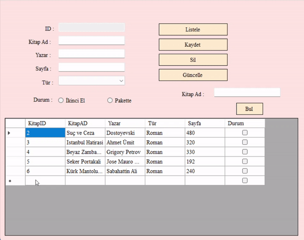
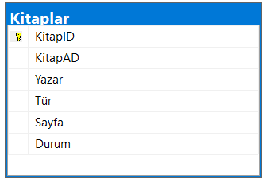

# Book Library Application 📚



This simple Windows Forms application provides a book database management system. Users can add, update, delete, and search for books. They can also mark the read status of books.

## Features 🌟

- Add, update, delete, and search for books.
- Mark the read status of books.
- User-friendly interface powered by database connection.

## Usage

1. **Clone the Project:**

   ```bash
    git clone https://github.com/Eraycann/Kitaplik/tree/master

    Open the project:    cd Kitaplik
    Open the solution file:    double click on projectname.sln
    Run the application:        Press F5 or click on Start button

The application will start and you can begin managing your books!

## Screenshots 📷



## Components

- **BookLibraryForm.cs**: The main form responsible for database operations.
- **App.cs**: The root component containing the BookLibraryForm.

## Contributing 🤝

Contributions are welcome! Feel free to enhance the design, add new features, or fix any issues. Open a pull request to contribute.

## License 📜

This project is licensed under the MIT License.

## Author ✨

- **Eraycan Sivri**
- **Contact**: nisagokdemir@gmail.com
- **GitHub**: [GitHub Profile](https://github.com/NisaGokdemir)

Manage and keep track of your books! 📚
